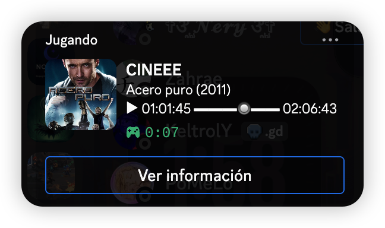
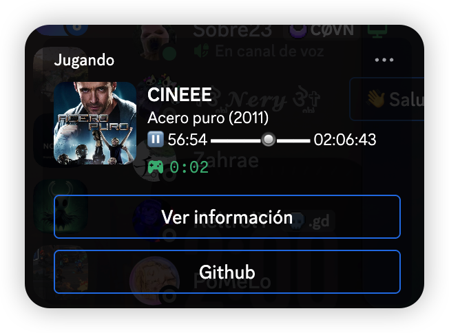
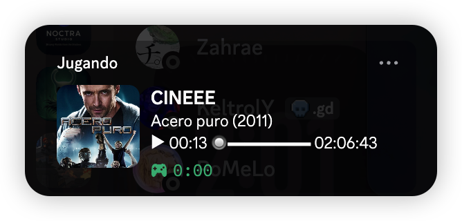

# Savin-cinema-rpc 🎬

Un mod multiplataforma y altamente personalizable que envía a Discord la información de lo que estás viendo en **local o streaming** utilizando **mpv**, incluyendo la carátula oficial del contenido y el minuto exacto de reproducción.

## 📺 Soporte Inteligente para Películas y Series
El script cuenta con un sistema de detección dinámica. Mediante expresiones regulares avanzadas, procesa y limpia los nombres de los archivos locales o en streaming (ideal para nubes remotas montadas con **rclone**). 

* **Películas:** Detecta el título y el año, buscando automáticamente el póster oficial en **The Movie Database (TMDB)**.
* **Series de Televisión / Anime:** Identifica patrones de nomenclatura estándar como `S01E02` o `1x02`. Al detectarlos, extrae el título de la serie para buscar su carátula global, añade un icono de televisión (`📺`) y formatea limpiamente el estado en Discord mostrando la **Temporada** y el **Episodio** junto a la barra de progreso. ¡Perfecto para tener tu perfil organizado sin importar lo alterados que estén los metadatos de tus archivos!

Bro, simplemente es brutal poder lucir la carátula real de lo que estás viendo aunque el archivo sea **p1r4t4**; el mod omite de forma inteligente todos los elementos basura como puntos, enlaces o etiquetas de códecs y hace el resto por ti.

---

## 🛠️ DEPENDENCIAS:

### Python 3 (Requisito previo):
* **🍏 macOS:** `brew install python` o descarga desde la [Web Oficial](https://www.python.org/downloads/mac-osx/)
* **🐧 Linux (Arch / CachyOS):** `sudo pacman -S python`
* **🐧 Linux (Ubuntu / Debian):** `sudo apt update && sudo apt install python3 python3-pip`
* **🪟 Windows:** Descarga desde la [Web Oficial](https://www.python.org/downloads/windows/) *(⚠️ Es crítico marcar la casilla "Add Python to PATH" al instalar)*

### Instalación automática con el asistente:
* **— pypresence —** Permite la comunicación por IPC con tu cliente de Discord.
* **— requests —** Se conecta de forma segura con la API de TMDB.

---

## ✨ Características

* **Botonera 100% Opcional y Modular:** Configura el diseño de tu Rich Presence desde el instalador. Activa o desactiva de forma independiente los botones de información o el de GitHub para cuidar la estética de tu perfil.
* **Limpieza por Regex Avanzada:** Purga automáticamente del título etiquetas de resolución, códecs y ripeos (`1080p`, `x264`, `x265`, `Bluray`, corchetes, paréntesis) antes de realizar la consulta de metadatos.
* **Soporte Bilingüe Automático:** Realiza búsquedas cruzadas en Español (es-ES) e Inglés (en-US) para asegurar que siempre se encuentre la ficha correcta.
* **Sincronización de Tiempo:** Mapeo en tiempo real del estado de reproducción, pausa congelada, tiempo transcurrido (se actualiza cada 10s) y duración total de la cinta mediante barras visuales (`▬🔘▬`).

---

## 📸 Ejemplos de Configuración Visual

Gracias al nuevo sistema modular, puedes elegir exactamente cómo lucirá tu perfil en Discord según tus preferencias de espacio:

### 1. Un botón (`Ver información`)
Muestra los detalles del archivo junto con un botón interactivo llamado **"Ver información"** que redirige a la ficha oficial de la película o serie en la web de TMDb.



### 2. Dos botones (`Info + GitHub`)
Ideal si quieres dar créditos al proyecto o enlazar tu propio repositorio de personalizaciones. Añade un botón directo hacia la plataforma de desarrollo.



### 3. Minimalista
Para los amantes del minimalismo absoluto. Si desactivas ambos botones en el instalador, la presencia se envía limpia sin ocupar espacio vertical innecesario, dejando un diseño compacto en el miniperfil de Discord.



---

## 🎥 Videotutorial de Demostración

Aquí tienes un pequeño tutorial y demostración del funcionamiento en tiempo real:

[](https://www.youtube.com/watch?v=TU_ID_DE_VIDEO)

---

## 📂 Arquitectura y Rutas por Sistema

El programa adapta su comportamiento e inyección de archivos según el entorno donde se ejecute:

| Sistema Operativo | Ruta del Script (`.py`) y Configuración | Ruta del Script de Lanzamiento (`.lua`) | Servidor IPC (`mpv.conf`) |
| :--- | :--- | :--- | :--- |
| **macOS** 🍏 | `~/.config/mpv/` | `~/.config/mpv/scripts/`<br>`~/Library/Application Support/mpv/scripts/` | `input-ipc-server=/tmp/mpvsocket` |
| **Linux** 🐧 | `~/.config/mpv/` | `~/.config/mpv/scripts/` | `input-ipc-server=/tmp/mpvsocket` |
| **Windows** 🪟 | `%APPDATA%\mpv\` | `%APPDATA%\mpv\scripts\` | `input-ipc-server=\\.\pipe\mpvsocket` |

---

## 🚀 Guía de Instalación Interactiva

### 🍏 En macOS
1. Descarga el archivo de instalación `Savin-cinema-rpc.command`.
2. Haz **doble clic** sobre él en el Finder.
3. Sigue las instrucciones de la terminal. El asistente te preguntará uno a uno si deseas incluir el botón de información y el de GitHub. Presiona `Enter` para aceptar la opción por defecto (**Sí**) o introduce `n` para denegarla.

> 💡 *Nota de macOS:* Si el sistema lo bloquea por seguridad la primera vez, haz clic derecho sobre el archivo y selecciona **Abrir**.

### 🐧 En Linux
1. Da permisos de ejecución al script instalador (`Savin-cinema-rpc.sh`):
   ```bash
   chmod +x Savin-cinema-rpc.sh

---

## ⚖️ Licencia

Este proyecto está bajo la Licencia GNU v3. Consulta el archivo `LICENSE` para obtener más detalles.
