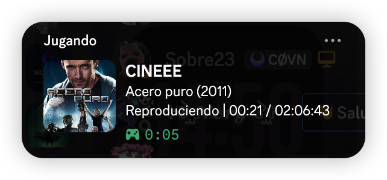
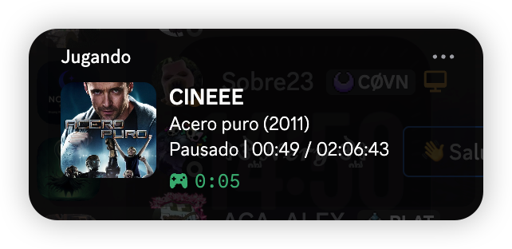

# Savin-cinema-rpc 🎬

Un mod muy simple que envía a discord la información de lo que estás viendo en **local o streaming** con **mpv**, incluyendo la carátula de la película y el minuto de reproducción.

Esta script detecta dinámicamente tu reproducción en mpv, procesa y limpia los nombres de los archivos locales o en streaming (ideal para combinar con **rclone** para usar una nube con películas en remoto) mediante expresiones regulares avanzadas, e interactúa con la API de **The Movie Database (TMDB)** para mostrar el póster oficial y el título estilizado de la película directamente en tu perfil de Discord.
<br><br>
Bro simplemente es brutal poder ver en discord la carátula de la película, hay varios mods de mpv pero este aplica una carátula aunque los metadatos de tu archivo **p1r4t4** estén modificados, con tan sólo poner el nombre del archivo con el título de la película (que en la mayor parte de las ocasiones no tendrás que hacerlo porque el mod omite todos los elementos como puntos o enlaces), el mod hace el resto.

---

## 🛠️ DEPENDENCIAS:

### Python 3 (Requisito previo):
* **🍏 macOS:** `brew install python` o descargar desde la [Web Oficial](https://www.python.org/downloads/mac-osx/)
* **🐧 Linux (Arch / CachyOS):** `sudo pacman -S python`
* **🐧 Linux (Ubuntu / Debian):** `sudo apt update && sudo apt install python3 python3-pip`
* **🪟 Windows:** Descargar desde la [Web Oficial](https://www.python.org/downloads/windows/) *(⚠️ Es crítico marcar la casilla "Add Python to PATH" al instalar)*

### Instalación automática con el programa:
* **— pypresence —** Permite la comunicación interna con tu cuenta de Discord.
* **— requests —** Se conecta con la API de TMDB para buscar y descargar las carátulas.

---

## ✨ Características

* **Soporte Multiplataforma Real**: Adaptado a las particularidades de sockets y tuberías de comunicación de cada sistema operativo (Sockets UNIX en macOS/Linux y Pipes Nombrados en Windows).
* **Limpieza por Regex Avanzada**: Purga automáticamente del título etiquetas de resolución, códecs y ripeos (`1080p`, `x265`, `Bluray`, corchetes, paréntesis) antes de buscar metadatos.
* **Integración Nativa con TMDB**: Localiza de manera inteligente carátulas y títulos oficiales con soporte bilingüe (Español/Inglés) en tiempo real.
* **Instaladores Inteligentes**: Automatización del despliegue de dependencias (`pypresence`, `requests`) e inyección automática del intérprete de Python adecuado con un solo clic.
* **Sincronización de Tiempo Precisa**: Mapeo en tiempo real del estado de pausa, tiempo transcurrido y duración total de la cinta.

---

## 📸 Ejemplos de Visualización

Así es como se ve tu perfil de Discord cuando el script está en funcionamiento. Al integrarse con TMDB, recupera dinámicamente los pósters oficiales en lugar de mostrar un icono genérico:

### 🎬 En Reproducción
Cuando estás viendo una película, muestra el título limpio, el año de lanzamiento, el estado actual y una barra de tiempo dinámica con el progreso exacto.



### ⏸️ En Pausa
Si detienes momentáneamente la reproducción, el estado de tu Rich Presence se actualiza al instante reflejando que la cinta está pausada y congelando el temporizador.



---

## Ve a ver mi vídeo de YT!!

Aquí tienes un pequeño tutorial y demostración del funcionamiento (muy pequeño ya que no tiene mucho misterio):

[](https://www.youtube.com/watch?v=TU_ID_DE_VIDEO)

---

## 📂 Arquitectura y Rutas por Sistema

El programa adapta su comportamiento e inyección de archivos según el entorno donde se ejecute:

| Sistema Operativo | Ruta del Script (`.py`) y Configuración | Ruta del Script de Lanzamiento (`.lua`) | Servidor IPC (`mpv.conf`) |
| :--- | :--- | :--- | :--- |
| **macOS** 🍏 | `~/.config/mpv/` | `~/.config/mpv/scripts/`<br>`~/Library/Application Support/mpv/scripts/` | `input-ipc-server=/tmp/mpvsocket` |
| **Linux** 🐧 | `~/.config/mpv/` | `~/.config/mpv/scripts/` | `input-ipc-server=/tmp/mpvsocket` |
| **Windows** 🪟 | `%APPDATA%\mpv\` | `%APPDATA%\mpv\scripts\` | `input-ipc-server=\\.\pipe\mpvsocket` |

---

## 🚀 Guía de Instalación

### 🍏 En macOS
1. Descarga el archivo de instalación `Savin-cinema-rpc.command`.
2. Haz **doble clic** sobre él en el Finder.
3. Sigue las instrucciones interactivas en la terminal (puedes presionar `Enter` para usar el Client ID por defecto o introducir uno personalizado).

> 💡 *Nota de macOS:* Si el sistema lo bloquea por seguridad la primera vez, haz clic derecho sobre el archivo y selecciona **Abrir**.

### 🐧 En Linux
1. Asegúrate de dar permisos de ejecución al script instalador (`Savin-cinema-rpc.sh`):
   ```bash
   chmod +x Savin-cinema-rpc.sh
   ```
2. Ejecútalo desde tu terminal:
   ```bash
   ./Savin-cinema-rpc.sh
   ```
3. El instalador detectará tu entorno de Python local e inyectará los scripts en tu estructura de `~/.config/mpv/`.

### 🪟 En Windows
1. Descarga y ejecuta el archivo por lotes `Savin-cinema-rpc.bat`.
2. El script se encargará de comprobar que Python esté añadido al `PATH` del sistema, instalará las librerías necesarias mediante `pip` de forma silenciosa y generará tanto el disparador Lua como el demonio Python en tu directorio `%APPDATA%\mpv\`.

> 💡 *Optimización para Windows:* El disparador Lua para Windows ejecuta el proceso en segundo plano utilizando `pythonw.exe` para evitar ventanas de comandos parpadeantes o molestas mientras disfrutas de la película.

---

## ⚖️ Licencia

Este proyecto está bajo la Licencia GNU v3. Consulta el archivo `LICENSE` para obtener más detalles.
